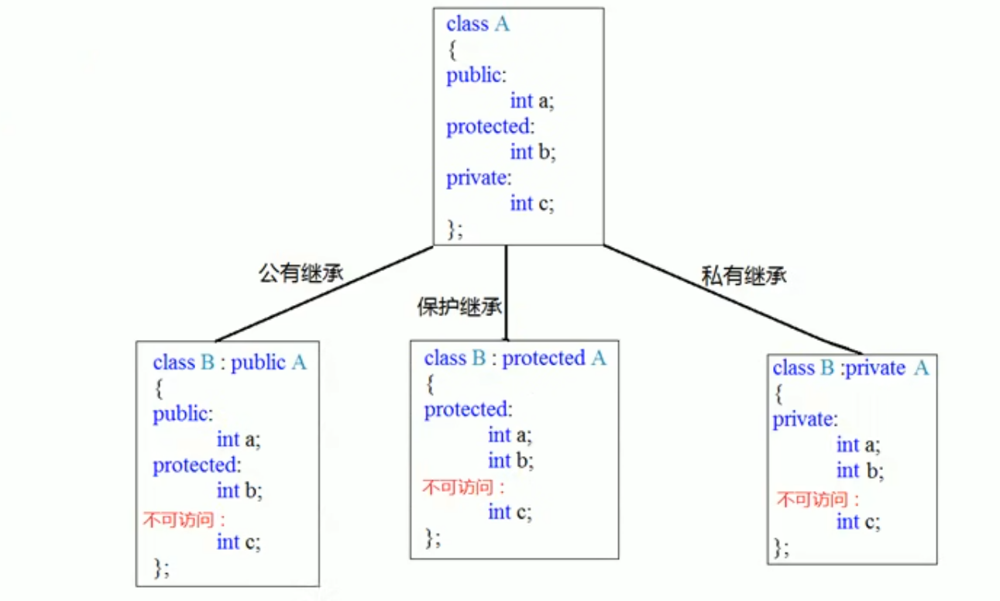
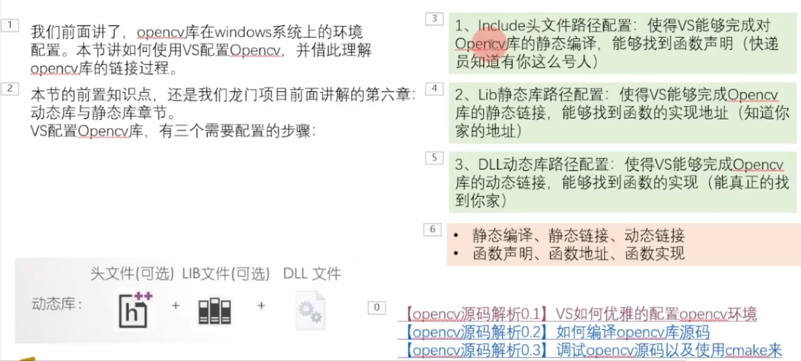
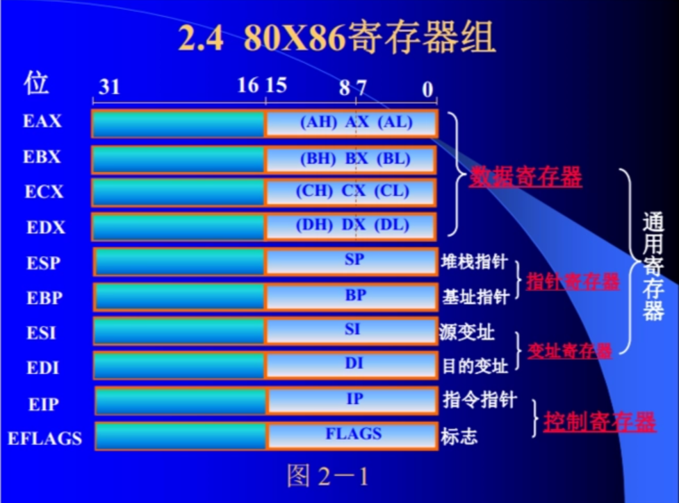
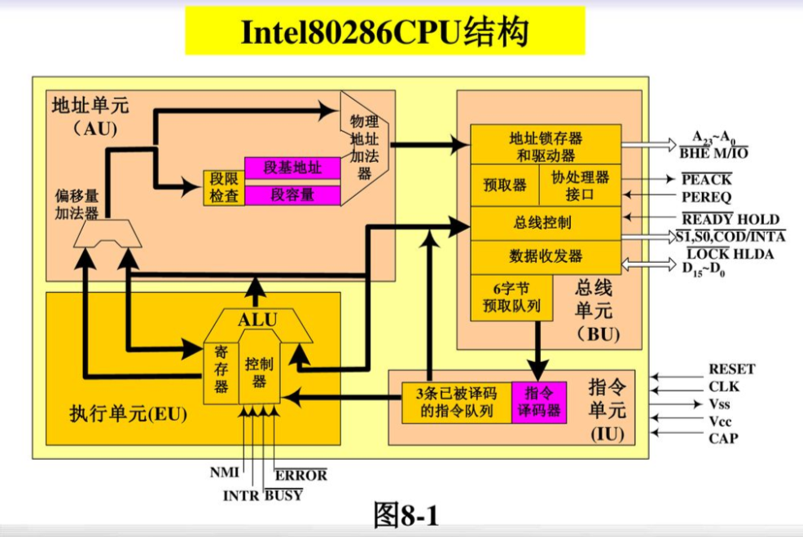

# 八股

## C和C++

C:        面向过程 结构体 public

C++： 类和对象  函数重载 有public protected private 异常处理try、throw  标准库STL   命名空间


## CMake

1.cmake_minimum_required(VERSION 3.14)

2.project(srsran)

3.set(CMAKE_CXX_STANDARD 14)                         # C++版本

   set(CMAKE_CXX_STANDARD_REQUIRED ON)   # 禁用版本回退

   message(STATUS "xxxxxxxxxxxxxxxxxxxxxxx.")

   set(LM_ROOT ${CMAKE_CURRENT_SOURCE_DIR} CACHE PATH "longmen root")

   set(LM_DEBUG_BUILD_DIR "${LM_ROOT}/Build" CACHE PATH "Debug Build Dir")

4.project

5.if() endif()

6.add_subdirectory(tests)                          # 添加tests子目录

   add_subdirectory(tests/test_doubles)  \# 嵌套子目录（一般不会这样加）

   add_library()

7.target_link_libraries(fmt ${CMAKE_THREAD_LIBS_INIT}) # 将线程库链接到fmt

8.include_directories(${CMAKE_SOURCE_DIR}/lib/sharedmemory/api)  # 在当前文件中引用共享内存功能的头文件

   include_directories(${CMAKE_SOURCE_DIR}/lib/sharedmemory/src)


## STL

stack top()

vector push() pop()

queue front() back()

list

set和map是C++ STL提供的关联容器，它们都使用红黑树来实现

迭代器是C++ STL中用于遍历容器元素的一种抽象概念，类似于指针。主要作用：访问元素、遍历、移动操作


## vector与list插入数据的区别

在C++中，`std::vector`和`std::list`是两种非常常用的容器，它们在插入数据时具有不同的行为和性能特点。以下是它们之间在插入数据方面的主要区别：

1. **内存布局**：
   1. `std::vector`是一个动态数组，它在内存中连续存储元素。因此，当在`vector`的中间插入元素时，可能需要移动插入点之后的所有元素以腾出空间，这可能导致较大的性能开销。
   2. `std::list`是一个双向链表，其元素不需要在内存中连续存储。因此，在`list`的任何位置插入元素（包括头部、尾部和中间）通常只需要调整几个指针，而不需要移动大量数据。
2. **插入操作的性能**：
   1. 对于`std::vector`，在尾部插入（使用`push_back`）通常是高效的，因为尾部通常有足够的预留空间。然而，在头部或中间插入可能非常低效，因为可能需要移动大量元素。
   2. 对于`std::list`，在头部或尾部插入（使用`push_front`或`push_back`）通常都非常高效，因为只需要调整少量指针。在列表中间插入（使用`insert`成员函数）虽然涉及更多的指针调整，但通常仍然比`vector`的中间插入要高效得多。
3. **容量与预留空间**：
   1. `std::vector`有一个`capacity`成员，它表示当前已分配的存储空间大小。当`vector`的大小达到其容量时，再插入元素会导致它重新分配更大的内存块并移动所有元素。这可以通过预先调用`reserve`成员函数来避免不必要的重新分配和移动。
   2. `std::list`没有这样的容量概念，因为它是通过链接节点来扩展的，而不是通过连续的内存块。因此，`list`的插入操作通常不会导致整个容器的重新分配。
4. **迭代器失效**：
   1. 当`std::vector`进行插入或删除操作时，指向容器内元素的迭代器、引用和指针可能会失效，因为元素可能会被移动。特别是，在插入点之后的迭代器、引用和指针都将失效。
   2. 对于`std::list`，只有在插入或删除点附近的迭代器、引用和指针才可能失效。插入或删除操作不会影响到其他位置的迭代器有效性。
5. **空间利用率**：
   1. 由于`std::vector`在内存中连续存储元素，它通常具有更好的空间利用率，特别是在存储小对象时。
   2. `std::list`由于使用额外的指针来链接节点，因此可能占用更多的内存，特别是当存储的对象本身很小时。

在选择使用`std::vector`还是`std::list`时，应根据具体的应用场景和需求进行权衡。如果需要频繁在中间插入或删除元素，或者需要保持迭代器在修改操作中的有效性，那么`std::list`可能更合适。如果主要操作是在尾部添加元素，并且需要高效的随机访问，那么`std::vector`可能更合适。


## emplace_back

emplace_back是C++11引入的一个成员函数，在vector末尾直接构造一个元素，而不是先构造一个临时的对象，再将对象移动或者拷贝到容器中

| 特性         | `emplace_back`                       | `push_back`                          |
| ------------ | ------------------------------------ | ------------------------------------ |
| **构造方式** | 直接在容器中构造对象                 | 先构造临时对象，再移动或拷贝到容器中 |
| **性能**     | 更高效，避免临时对象的创建和移动操作 | 可能有额外的临时对象创建和移动操作   |
| **参数传递** | 直接传递构造参数                     | 需要传递一个完整的对象               |
| **适用场景** | 适用于复杂对象或需要高效构造的场景   | 适用于简单对象或已有对象的插入       |


## 继承

继承：子类继承父类的一些成员函数和成员变量，也就是一些属性和方法，并且可以增加新的属性和方法或者修改




## 多态

静态类型是在**编译期确定的，就比如普通成员方法**，动态类型是在**运行时确定的，由虚函数指针在虚函数表中查找到作相应方法地址进行调用。**

**多态**：在继承中可以通过虚函数和函数重，当基类指针指向子类对象，通过调用虚函数，来实现不同对象之间不同的行为

**静态多态**：通过函数重载来实现，函数重载是指在同名的函数中提供不同的参数（顺序、类型或者个数）

**动态多态**：通过虚函数和函数重写来实现，当通过基类指针或者引用来调用虚函数的时候，会根据对象的实际类型调用哪个方法，这种实现是在运行时动态确定的

```C++
class Animal {
public:
    virtual void speak() const {
        std::cout << "Animal sound" << std::endl;
    }
    virtual ~Animal() = default; // 虚析构确保派生类正确释放
};

class Dog : public Animal {
public:
    void speak() const override {
        std::cout << "Woof!" << std::endl;
    }
};

class Cat : public Animal {
public:
    void speak() const override {
        std::cout << "Meow!" << std::endl;
    }
}; 
  
int main() {
    std::unique_ptr<Animal> pet = std::make_unique<Dog>(); // 智能指针托管Dog对象
    pet->speak(); // 输出 "Woof!"

    pet = std::make_unique<Cat>(); // 自动释放原对象并托管新Cat对象
    pet->speak(); // 输出 "Meow!"
    return 0;
}
/*
int main() {  
    Animal* animal = new Dog();  // 指向Base对象的指针  
    animal->speak();   
    delete animal;  
  
    animal = new Cat();  // 现在指向Derived对象的指针，但类型仍为Animal*  
    animal->speak();  // 输出 "Derived::show()"，尽管ptr是Base*类型  
    delete animal;  
  
    return 0;  
}

int main() {
    Animal* animal[] = {new Dog(), new Cat()};  // 基类指针数组
    
    for (Animal* animal : animal) {
        animal->speak();  // 运行时动态绑定到实际对象的draw()
        delete animal;   // 通过虚析构正确销毁对象
    }
    return 0;
}

*/
```


## 多态、虚函数和虚函数表

问：C++的多态怎么实现的？

答：多态主要通过虚函数和继承来实现。

**虚函数**：在基类中使用virtual关键字声明函数，派生类可以重写这些函数

```C++
class Base {  
public:  
    // 声明一个虚函数  
    virtual void show() {  
        std::cout << "Base::show()" << std::endl;  
    }  
};  
  
class Derived : public Base {  
public:  
    // 重写基类中的虚函数  
    void show() override {  
        std::cout << "Derived::show()" << std::endl;  
    }  
};  
  
int main() {  
    Base* ptr = new Base();  // 指向Base对象的指针  
    ptr->show();  // 输出 "Base::show()"  
    delete ptr;  
  
    ptr = new Derived();  // 现在指向Derived对象的指针，但类型仍为Base*  
    ptr->show();  // 输出 "Derived::show()"，尽管ptr是Base*类型  
    delete ptr;  
  
    return 0;  
}
```


**纯虚函数**：在基类声明但不实现的虚函数，使类成为抽象类，不能实例化

```C++
class AbstractBase {
public:
    virtual void show() = 0;  // 纯虚函数
};

class ConcreteDerived : public AbstractBase {
public:
    void show() override {
        std::cout << "ConcreteDerived class show" << std::endl;
    }
};
```


**虚函数表**：当virtual出现时候会有虚函数指针（vfptr）指向虚函数表（v-table）

当对象被创建时，其vptr会被初始化为指向该对象的类的v-table。当通过基类指针或引用来调用虚函数时，程序会使用vptr来查找v-table中相应的函数地址，并调用它。

```Plaintext
Base v-table:  
+----------------+  
| &Base::func1 | --> Base::func1 的地址  
+----------------+  
| &Base::func2 | --> Base::func2 的地址  
+----------------+  
| &Base::~Base | --> Base 析构函数的地址  
+----------------+  
  
Derived v-table:  
+----------------+  
| &Derived::func1 | --> Derived::func1 的地址（重写了Base::func1）  
+----------------+  
| &Base::func2 | --> Base::func2 的地址（未被重写，使用基类的版本）  
+----------------+  
| &Base::~Base | --> Base 析构函数的地址（通常与基类的析构函数相同，除非有特殊的析构逻辑）  
+----------------+
```


## 内部类与外部类的相互访问

问题1：B是A的内部类，B能否访问A的private成员？A能否访问B的private成员？

答：B能访问A的private，A不能访问B的private，除非通过友元或者内部类B提供的公共接口（例如：公有成员函数）来访问

```C++
class A {  
private:  
    int privateMember;  
  
public:  
    A(int value) : privateMember(value) {}  
  
    // 内部类B  
    class B {  
    public:  
        void printAMember(const A& outer) {  
            // 内部类B可以访问外部类A的私有成员  
            std::cout << "Value of A's private member: " << outer.privateMember << std::endl;  
        }  
  
    private:  
        int bPrivateMember;  
    };  
};
```

```C++
int main() {  
    A a(42); // 创建一个外部类A的对象，并初始化其私有成员  
  
    // 创建一个内部类B的对象（需要通过外部类A的作用域来创建）  
    A::B b;  
  
    // 调用内部类B的成员函数，并传入外部类A的对象  
    b.printAMember(a); // 输出：Value of A's private member: 42  
  
    // 尝试从外部类A直接访问内部类B的私有成员（这是不允许的）  
    // A::B::bPrivateMember; // 错误：'bPrivateMember' 在 'A::B' 中是私有的  
  
    return 0;  
}
```

在`main`函数中，创建了一个外部类A的对象`a`，并初始化其私有成员`privateMember`。接着，创建了一个内部类B的对象`b`（注意，创建内部类对象时需要通过外部类的作用域）。然后调用`b`的`printAMember`成员函数，并传入`a`作为参数，该函数成功打印了外部类A的私有成员的值。

最后一行试图从外部类A直接访问内部类B的私有成员`bPrivateMember`，这是不允许的，会导致编译错误。这是因为`bPrivateMember`是内部类B的私有成员，外部类A没有直接访问它的权限。


问题2：友元破坏了封装性，那么不破坏封装性的情况下怎么做？

答：如果外部类A想要访问内部类B的私有成员，可以通过将外部类A声明为内部类B的友元来实现，但通常这不是一个好的做法，因为它破坏了封装性。在实际编程中，应该尽量避免这种设计，而是使用内部类提供的公共接口来交互。例如 提供 getter/setter接口。

```C++
#include <iostream>  
  
class A {  
private:  
    int privateMember;  
  
public:  
    A(int value) : privateMember(value) {}  
  
    // 内部类B  
    class B {  
    public:  
        B(A& outer) : outerInstance(outer) {}  
  
        void setAMember(int value) {  
            // 通过外部类A的公有接口设置私有成员的值  
            outerInstance.setPrivateMember(value);  
        }  
  
        int getAMember() const {  
            // 通过外部类A的公有接口获取私有成员的值  
            return outerInstance.getPrivateMember();  
        }  
  
    private:  
        A& outerInstance; // 引用外部类A的对象  
    };  
  
    // 外部类A的公有接口，用于设置私有成员的值  
    void setPrivateMember(int value) {  
        privateMember = value;  
    }  
  
    // 外部类A的公有接口，用于获取私有成员的值  
    int getPrivateMember() const {  
        return privateMember;  
    }  
};  
  
int main() {  
    A a(10); // 外部类A的对象  
    A::B b(a); // 内部类B的对象，绑定到外部类A的对象上  
  
    // 通过内部类B的公共接口设置和获取外部类A的私有成员的值  
    b.setAMember(20);  
    std::cout << "Value of A's private member through B: " << b.getAMember() << std::endl; // 输出：20  
  
    // 也可以通过外部类A的公有接口直接操作私有成员  
    a.setPrivateMember(30);  
    std::cout << "Value of A's private member directly: " << a.getPrivateMember() << std::endl; // 输出：30  
  
    return 0;  
}
```

在这个示例中，内部类B持有一个对外部类A对象的引用，并通过A的公有接口`setPrivateMember`和`getPrivateMember`来设置和获取其私有成员的值。这样，外部类A的封装性得到了保持，因为它不允许任何类直接访问其私有成员，而只能通过其提供的公有接口进行操作。


## lambda表达式

lambda表达式，用于匿名函数，可以直接在代码中声明并立即使用，无需像常规函数那样在全局或者局部作用域下定义函数名称。

```c++
auto add = [](int a, int b) -> int {
    return a + b;
};
void add
add(2,3)
```

优点：简洁性，减少代码量，无需额外定义函数；灵活性，可以轻松地在需要函数式编程的地方使用；内联，lambda表达式通常会被编译器内联，提高执行效率；封闭性，轻松访问外部作用域的变量

应用场景：STL算法中作为排序函数、谓语函数；多线程编程中作为线程函数或者任务函数；在函数对象需要简短定义的地方，例如回调函数、比较函数等

下面是两个使用Lambda表达式的示例代码：

1. 在STL算法中作为谓词函数：

```C++
#include <iostream>
#include <vector>
#include <algorithm>

int main() {
    // 创建一个包含一些整数的向量
    std::vector<int> numbers = {1, 2, 3, 4, 5, 6, 7, 8, 9, 10};

    // 使用std::count_if算法统计向量中大于5的元素个数
    int count = std::count_if(numbers.begin(), numbers.end(), [](int x) { return x > 5; });

    std::cout << "Count of numbers greater than 5: " << count << std::endl;

    return 0;
}
```

在这个示例中，Lambda表达式 `[](int x) { return x > 5; }` 作为`std::count_if`的谓词函数，用于判断向量中的元素是否大于5。该Lambda表达式接受一个参数`x`，并返回一个bool值，表示`x`是否大于5。

1. 在STL算法中作为排序函数：

```C++
#include <iostream>
#include <vector>
#include <algorithm>

int main() {
    // 创建一个包含一些字符串的向量
    std::vector<std::string> words = {"apple", "banana", "orange", "grape", "watermelon"};

    // 使用std::sort算法对向量中的字符串按照长度进行排序
    std::sort(words.begin(), words.end(), [](const std::string& a, const std::string& b) {
        return a.size() < b.size(); // 按照字符串长度从小到大排序
    });

    // 输出排序后的字符串向量
    std::cout << "Sorted words:" << std::endl;
    for (const auto& word : words) {
        std::cout << word << std::endl;
    }

    return 0;
}
```

在这个示例中，Lambda表达式 `[](const std::string& a, const std::string& b) { return a.size() < b.size(); }` 作为`std::sort`的排序函数，用于按照字符串长度从小到大对字符串进行排序。


## C++运算符

C++运算符分两大类：单目运算符与双目运算符。


## C++内存分区

常量区  const 常量字符串等静态数据

全局 / 静态区  全局变量和静态变量，在程序启动时分配，在程序结束时释放， 不受函数作用域的限制

堆区

栈区 栈区内存由编译器自动分配和释放 存储函数的局部变量和函数参数

您提到的分类方式（常量区、全局/静态区、堆区、栈区）是另一种常见的内存布局划分方法，与之前提到的代码段/数据段/BSS段本质相同，只是命名和细分角度不同。以下是两种分类的对应关系及详细说明：

------

‌**内存区域对照表**‌

| ‌**传统分类**‌     | ‌**分类**‌       | ‌**存储内容**‌                                                 | ‌**是否可修改**‌ | ‌**生命周期**‌   |
| ---------------- | -------------- | ------------------------------------------------------------ | -------------- | -------------- |
| ‌**代码段(Text)**‌ | 常量区（部分） | 程序指令、字符串常量（如`"Hello"`）、`constexpr`数据。       | 只读           | 程序启动到结束 |
| ‌**数据段(Data)**‌ | 全局/静态区    | 显式初始化的全局变量、静态变量（如`int g_val=5; static int s_val=10;`）。 | 可修改         | 程序启动到结束 |
| ‌**BSS段**‌        | 全局/静态区    | 未初始化的全局/静态变量（默认置零，如`int arr[100];`）。     | 可修改         | 程序启动到结束 |
| ‌**堆(Heap)**‌     | 堆区           | 动态分配的内存（`malloc/new`）。                             | 可修改         | 手动控制       |
| ‌**栈(Stack)**‌    | 栈区           | 局部变量、函数参数、返回地址等。                             | 可修改         | 函数调用期间   |


## C++对象切片

什么是对象切片？

对象切片是指当我们直接把**子类对象**赋值给**基类对象**(注意不是指针或引用)，会发生**向上转换**，也就是**子类对象转换成基类对象**，子类中重写的函数和定义的变量将不复存在，这种赋值就是调用拷贝运算符的过程，包括如果函数参数列表是基类对象，传入子类对象，返回值等等

```c++
#include <iostream>
class A{
public:
    virtual void print()
    {
        std::cout<<"hello A!"<<std::endl;
    }
};

class B:public A{
public:
    void print() override{
        std::cout<<"hello B!"<<std::endl;
    }
};
int main()
{
    A a;
    B b;
    //a.print();//输出"hello A!"
    //b.print();//输出"hello B!"
    a=b; // 子类对象赋值给基类对象
    a.print();//输出"hello A"
}
```

如何解决？

当发生对象切片时，我们**不能再调用子类的虚函数方法**，而且程序不会报错，这时候我们就来漫长的debug，这肯定影响我们摸鱼。这时候是不是想起一个东西，纯虚函数，只要把基类定义为纯虚类，将需要用的方法定义成纯虚函数，因为抽象类是不能被实例化的，否则编译器报错，这样就很容易能找到错误 。还有一个方法，我们可以传指针嘛，这当然不是和大部分场景

这里我们了解了什么是对象切片，是由于对象的隐式向上转换造成的，避免他是为了保护我们的多态正常使用，说到底还是从多态抓起，**什么是多态**，简单来说就是希望我们**相同的消息传到不同的对象中能够引发不同的行为**，比如经典的：

```c++
#include <iostream>
class Animal{
 public:
    virtual void speak()
    {
        std::cout<<"aaaaa!"<<std::endl;
    }
};
class Dog:public Animal{
 public:
    void speak() override{
        std::cout<<"woof"<<std::endl;
    }
};
class Cat:public Animal{
 public:
    void speak() override{
        std::cout<<"主人~"<<std::endl;
    }
};
int main()
{
   Dog a;
   Cat b;
   Animal *animal = &a; 
   ani->speak();//"woof"
   ani = &b;
   ani->speak();//"主人~"
   return 0;
}
```

这样我们就实现了我们的多态，C++的多态就是利用基类指针或引用指向不同的子类，调用相同的方法会引发不同的行为，这叫运行时多态，我们需要把相应方法声明为虚方法，告诉编译器，这个方法在子类可能有重写，先不决定调用哪个。在C++中，一个对象的类型有动态类型和静态类型，静态类型是在编译期确定的，就比如普通成员方法，动态类型是在运行时确定的，由虚函数指针在虚函数表中查找到作相应方法地址进行调用。

但是我们总有需要向下转换和向上转换的时候

我们可以用`static_cast`:

```c++
Child *child = new Child();
Parent *parent = static_cast<Parent*>(child);
Parent *parent = new Parent();
Child *child = static_cast<Child*>(parent);
```


## C++11 新特性

lambda

auto

for循环遍历

constexpr：编译时求值

nullptr：空指针关键字

智能指针

右值引用


## C++智能指针

智能指针是C++中用于管理动态分配内存的工具

**1. std::unique_ptr **是一种独占所有权的智能指针，管理动态分配的对象，确保对象只有一个所有者，适用于需要严格所有权管理的情况。详细游戏对象场景

```C++
std::unique_ptr<int> ptr = std::make_unique<int>(42);
#include <iostream>
#include <memory>

int main() {
    // 创建一个 unique_ptr，拥有一个动态分配的整数
    std::unique_ptr<int> ptr = std::make_unique<int>(42)
    //等价于std::unique_ptr<int> ptr(new int(42));
    

    // 输出 unique_ptr 所指向的整数的值
    std::cout << "Value pointed by ptr: " << *ptr << std::endl;

    // 修改 unique_ptr 所指向的整数的值
    *ptr = 100;

    // 再次输出 unique_ptr 所指向的整数的值
    std::cout << "New value pointed by ptr: " << *ptr << std::endl;

    // 当 unique_ptr 超出作用域时，所管理的内存会自动释放
    return 0;
} // 在此处，unique_ptr 超出作用域，动态分配的整数会被释放

```

`std::unique_ptr` 是独占式的智能指针，不能进行复制操作，但可以进行移动操作。因此，它适用于在需要独占所有权的场景中，能够提供更高效的内存管理。

```C++
std::unique_ptr<int> ptr1 = std::make_unique<int>(42)；
std::unique_ptr<int> ptr2 = ptr1; // 错误！不能进行复制操作

std::unique_ptr<int> ptr1 = std::make_unique<int>(42)；
std::unique_ptr<int> ptr2 = std::move(ptr1); // 使用 std::move 进行移动操作
```

**2. std::shared_ptr** 是一种共享所有权的智能指针它允许多个 `std::shared_ptr` 对象共享对同一对象的所有权。

- 就像一个“合伙人”，可以与其他共享式指针共同拥有和管理同一个内存资源。
- 引入了一个计数器来跟踪有多少个共享指针共享了同一个资源，当计数器为0时释放内存。

```C++
#include <iostream>
#include <memory>

void print_shared_ptr_count(const std::shared_ptr<int>& ptr) {
    std::cout << "SharedPtr count: " << ptr.use_count() << std::endl;
}

int main() {
    // 创建一个 shared_ptr，拥有一个动态分配的整数
    std::shared_ptr<int> ptr1 = std::make_shared<int>(42);
    printSharedPtrCount(ptr1); // 打印当前的引用计数

    // 创建另一个 shared_ptr，与 ptr1 共享同一个动态分配的整数
    std::shared_ptr<int> ptr2 = ptr1;
    printSharedPtrCount(ptr1);2 // 打印当前的引用计数
    printSharedPtrCount(ptr2); 2// 打印当前的引用计数

    // 修改 ptr1 指向的整数的值
    *ptr1 = 100;

    // 输出 ptr1 和 ptr2 指向的整数的值
    std::cout << "Value pointed by ptr1: " << *ptr1 << std::endl;
    std::cout << "Value pointed by ptr2: " << *ptr2 << std::endl;

    // 当 ptr1 和 ptr2 超出作用域时，所管理的内存会自动释放
    return 0;
} // 在此处，ptr1 和 ptr2 超出作用域，动态分配的整数会被释放
```

```C++
std::shared_ptr<int> ptr1 = std::make_shared<int>(42);
std::shared_ptr<int> ptr2 = ptr1; // 共享所有权
```

**3. std::weak_ptr** 是弱引用指针，解决 `std::shared_ptr` 的循环引用问题，避免内存泄漏

- 就像一个“旁观者”，它可以观察到共享指针管理的资源，但是不会影响资源的生命周期。
- 主要用于避免 `std::shared_ptr` 的循环引用问题，因为它不会增加引用计数。

什么是循环引用问题？

循环引用是指两个或多个对象相互引用，导致它们的引用计数永远不会归零，从而无法释放内存，造成内存泄漏。`std::weak_ptr` 的主要作用之一就是解决 `std::shared_ptr` 的循环引用问题。

下面是一个简单的循环引用示例：

```C++
#include <iostream>
#include <memory>

class Node {
public:
    Node() {
        std::cout << "Node Constructor" << std::endl;
    }
    ~Node() {
        std::cout << "Node Destructor" << std::endl;
    }
    std::shared_ptr<Node> next;
};

int main() {
    std::shared_ptr<Node> node1 = std::make_shared<Node>();
    std::shared_ptr<Node> node2 = std::make_shared<Node>();

    // 创建循环引用
    node1->next = node2;
    node2->next = node1;

    return 0;
}
```

在这个示例中，`node1` 和 `node2` 分别持有对彼此的 `std::shared_ptr`，形成了循环引用。即使在 `main()` 函数结束时，它们的引用计数也不会归零，导致它们所指向的内存资源永远不会被释放，造成了内存泄漏。

使用 `std::weak_ptr` 可以打破循环引用，示例代码可以修改如下：

```C++
#include <iostream>
#include <memory>

class Node {
public:
    Node() {
        std::cout << "Node Constructor" << std::endl;
    }
    ~Node() {
        std::cout << "Node Destructor" << std::endl;
    }
    std::weak_ptr<Node> next; // 使用 weak_ptr
};

int main() {
    std::shared_ptr<Node> node1 = std::make_shared<Node>();
    std::shared_ptr<Node> node2 = std::make_shared<Node>();

    // 创建循环引用
    node1->next = node2;
    node2->next = node1;

    return 0;
}
```

这样，即使 `node1` 和 `node2` 彼此持有 `std::shared_ptr`，但由于使用了 `std::weak_ptr`，在 `main()` 函数结束后，它们的引用计数会归零，所指向的内存资源会被正确释放，避免了内存泄漏。

智能指针可以帮助我们更方便、更安全地管理动态内存，避免内存泄漏和野指针问题，提高代码的可靠性和可维护性。


在C++中，`std::unique_ptr`的创建方式主要有两种，可能代码中没有直接使用`new`，但底层机制仍然涉及堆内存分配：

1. ‌**隐式使用new的情况**‌
   当使用`std::make_unique`时（C++14起支持），它内部会自动调用`new`进行堆内存分配14。例如：

   ```c++
   auto ptr = std::make_unique<int>(42);  // 内部等价于 new int(42)
   ```

2. ‌**代码中的设计模式**‌
   代码通过构造函数参数传递`std::unique_ptr`，此时所有权转移的原始指针最初仍需通过`new`或`make_unique`创建。例如：

   ```c++
   // 调用方可能这样使用：
   handler.handle_du_connection_request(std::make_unique<dummy_notifier>());
   ```


## C++重载

C++如何支持重载：

1. **名称修饰（Name Mangling）**：C++编译器在编译时会对函数名进行修饰，以包含函数的参数类型信息。这样，即使函数名相同，只要参数类型不同，编译器也能区分它们，生成不同的函数标识符。
2. **类型系统**：C++的类型系统比C语言更为复杂和丰富。C++支持多种数据类型，包括用户自定义的类型（如类和结构体），这使得函数可以根据参数类型的不同进行重载。
3. **链接器解析**：在链接阶段，C++链接器会根据修饰后的函数名来解析和链接函数。因此，即使函数名相同，只要参数类型不同，链接器也能正确地找到对应的函数实现


## C++中四个cast

C++中提供了四种类型转换操作符，也被称为“cast”操作符，分别是：`static_cast`、`dynamic_cast`、`const_cast`和`reinterpret_cast`。它们各自有不同的用途和适用场景。下面我将详细解释`dynamic_cast`和`static_cast`，并提供相关的代码示例。

以下是C++中四种cast的比较表格：

| Cast类型         | 功能描述                            | 安全性                           | 使用场景                                    | 示例                                                |
| ---------------- | ----------------------------------- | -------------------------------- | ------------------------------------------- | --------------------------------------------------- |
| dynamic_cast     | 用于类继承体系中的安全转换          | 相对安全（运行时检查）           | 转换基类指针或引用为派生类指针或引用        | Derived* derived = dynamic_cast<Derived*>(basePtr); |
| static_cast      | 进行多种类型转换                    | 较低安全性（编译时转换）         | 基本数据类型转换、非多态类型转换、void*转换 | int i = static_cast<int>(3.14);                     |
| const_cast       | 移除或添加类型的const或volatile属性 | 中等安全性（需谨慎使用）         | 修改常量对象的值、去除指针或引用的const属性 | const int* pc = &i; int* p = const_cast<int*>(pc);  |
| reinterpret_cast | 提供任意类型之间的转换              | 最低安全性（几乎不进行任何检查） | 不同类型指针之间的转换、整数到指针的转换    | int* ip = reinterpret_cast<int*>(ptr);              |

注意：

- `dynamic_cast` 主要用于多态类型的转换，它依赖于运行时类型信息（RTTI），因此只能用于包含虚函数的类。它在运行时检查转换是否有效，如果转换失败，则返回空指针（对于指针类型）或抛出异常（对于引用类型）。
- `static_cast` 是最通用的类型转换操作符，但它只进行编译时检查，不保证转换的安全性。如果转换不合适，可能会导致运行时错误。
- `const_cast` 用于修改const对象的值或去除指针/引用的const属性。使用它时需要特别小心，因为不当的使用可能会破坏程序的逻辑和安全性。
- `reinterpret_cast` 提供最灵活但也最危险的转换。它可以转换几乎任何类型到任何类型，几乎不进行任何检查。因此，除非绝对必要，否则应避免使用它。

在选择使用哪种cast时，应根据具体的转换需求、安全性和上下文来综合考虑。

下面咱们重点来分析两种：


**1.dynamic_cast**

`dynamic_cast`主要用于在类继承体系中进行安全的向下和侧向类型转换。当转换成功时，返回转换后的类型的指针或引用；如果转换失败（例如，尝试将一个基类指针转换为派生类指针，但实际上该基类指针并不指向派生类对象），则返回空指针（对于指针类型）或抛出异常（对于引用类型）。

**使用场景**：

- 在类继承体系中，从基类指针或引用转换为派生类指针或引用。
- 检查转换是否安全。

**示例**：

```C++
class Base {  
public:  
    virtual ~Base() {}  
};  
  
class Derived : public Base {  
};  
  
int main() {  
    Base* basePtr = new Base;  
    Derived* derivedPtr = dynamic_cast<Derived*>(basePtr); 
    // 转换失败，返回nullptr  
    if (derivedPtr == nullptr) {  
        std::cout << "dynamic_cast failed" << std::endl;  
    }  
  
    basePtr = new Derived;  
    derivedPtr = dynamic_cast<Derived*>(basePtr); // 转换成功  
    if (derivedPtr != nullptr) {  
        std::cout << "dynamic_cast succeeded" << std::endl;  
    }  
    delete basePtr;  
    return 0;  
}
```


**2.static_cast**

`static_cast`可以进行多种类型转换，包括但不限于基本数据类型之间的转换、非多态类型之间的转换、空指针和空类型的转换、以及将任何类型的指针转换为`void*`或`void*`转换为任何类型的指针。

**使用场景**：

- 基本的数值类型转换（如int转double）。
- 非多态类型之间的转换（如struct转换）。
- 将指针或整数转换为`void*`，或将`void*`转换回原始指针类型。
- 类的上行转换（从派生类转换为基类）。

**示例**：

```C++
int main() {  
    double d = 3.14;  
    int i = static_cast<int>(d); // 数值类型转换  
    std::cout << i << std::endl; // 输出3  
  
    void* ptr = &i; // 任意类型的指针都可以转换为void*  
    int* originalPtr = static_cast<int*>(ptr); // 将void*转换回原始类型  
  
    class Base {};  
    class Derived : public Base {};  
    Derived d;  
    Base* basePtr = static_cast<Base*>(&d); // 类的上行转换  
  
    return 0;  
}
```


**3.reinterpret_cast** 

`reinterpret_cast` 是 C++ 中的一个类型转换操作符，它提供了一种低级别的、不安全的转换机制，允许将任何指针或整数类型转换为任何其他指针或整数类型。这种转换不执行任何运行时检查，因此它可能会导致未定义的行为，除非你确定转换是安全的。

以下是一些 `reinterpret_cast` 的使用场景和代码例子：

**将整数转换为指针**

在某些情况下，你可能需要将一个整数（通常是一个地址）转换为指针。虽然这通常不是安全的做法，但 `reinterpret_cast` 可以帮助你完成这个任务。

```C++
// 假设我们有一个整数，它实际上是一个内存地址  
int address = 0x12345678; // 示例地址值  
  
// 使用 reinterpret_cast 将整数转换为 void* 类型的指针  
void* ptr = reinterpret_cast<void*>(address);  
  
// 注意：这种转换在不知道确切地址指向内容的情况下是危险的
```

**将指针转换为整数**

类似地，你可能需要将一个指针转换为一个整数。这通常用于获取指针的底层地址值。

```C++
// 假设我们有一个指向整数的指针  
int* intPtr = new int(42);  
  
// 使用 reinterpret_cast 将指针转换为 uintptr_t 类型的整数  
// uintptr_t 是一个足够大的无符号整数类型，能够存储任何指针的值  
uintptr_t intAddress = reinterpret_cast<uintptr_t>(intPtr);  
  
// 现在 intAddress 存储了 intPtr 的地址值
```

注意：使用 `uintptr_t` 是更安全的做法，因为它是一个无符号整数类型，其大小足以存储任何指针值。

**转换不同类型的指针**

有时，你可能需要将一种类型的指针转换为另一种类型的指针，尤其是在处理底层编程或硬件相关代码时。

```C++
// 假设我们有一个指向整数的指针  
int* intPtr = new int(42);  
  
// 使用 reinterpret_cast 将 int* 转换为 char*  
// 这种转换在需要对内存进行底层操作或硬件交互时可能有用  
char* charPtr = reinterpret_cast<char*>(intPtr);  
  
// 注意：这种转换假定两种类型在内存中的布局是兼容的，这通常不是安全的假设
```


**4.const_cast**

1. 去除指针的 `const` 属性

```C++
const int a = 10;  
const int* ptr = &a; // ptr 指向一个 const int  
  
// 使用 const_cast 去除 const 属性  
int* nonConstPtr = const_cast<int*>(ptr);  
  
// 尝试通过非 const 指针修改值（这是不安全的，因为 a 实际上是 const）  
//*nonConstPtr = 20; // 这将导致未定义行为
```

2. 去除引用的 `const` 属性

```C++
const int b = 20;  
const int& ref = b; // ref 引用一个 const int  
  
// 使用 const_cast 去除 const 属性（注意：对引用的 const_cast 是不安全的）  
int& nonConstRef = const_cast<int&>(ref);  
  
// 尝试通过非 const 引用修改值（这是不安全的，因为 b 实际上是 const）  
//nonConstRef = 30; // 这将导致未定义行为
```

3. 在模板中处理 const 和非 const 对象

有时在编写模板时，你可能需要处理 const 和非 const 对象。`const_cast` 可以用于处理这种情况，但应谨慎使用。

```C++
template <typename T>  
void printValue(T& value) {  
    // 假设我们有一个函数，它可能修改值也可能不修改  
    // 如果 T 是 const 类型，我们不应该尝试修改它  
    if constexpr (std::is_const_v<T>) {  
        std::cout << "Value is: " << value << std::endl;  
    } else {  
        // 使用 const_cast 去除 const 属性，但在这里是安全的，因为我们知道 T 不是 const  
        auto& nonConstValue = const_cast<std::remove_const_t<T>&>(value);  
        nonConstValue *= 2; // 修改值  
        std::cout << "Modified value is: " << value << std::endl;  
    }  
}  
  
int main() {  
    int x = 5;  
    const int y = 10;  
      
    printValue(x); // 输出 Modified value is: 10  
    printValue(y); // 输出 Value is: 10  
      
    return 0;  
}
```

在这个例子中，`printValue` 模板函数接受一个引用参数，并检查它是否是 `const` 类型。如果不是 `const` 类型，则使用 `const_cast` 去除 `const` 属性并修改值。然而，请注意，模板函数内部有一个 `if constexpr` 语句来确保只有当 `T` 不是 `const` 类型时，才执行修改操作。

**注意事项**:

- `const_cast` 通常用于移除指针或引用的 `const` 限定符，但不应该用于修改实际上应为 `const` 的对象。
- 在使用 `const_cast` 之前，请确保你完全理解为什么需要这么做，并且确保这样做是安全的。
- 如果对象实际上是 `const` 的，那么通过 `const_cast` 修改它会导致未定义行为。
- 尽量避免在不需要的情况下使用 `const_cast`，因为它可能隐藏错误或使代码更难理解。


## C++左值、右值与std：：move讲解


## typeid、RTTI

`typeid` 是 C++ 中的一个运算符，用于在运行时查询对象的类型信息。它是 RTTI（运行时类型识别，Run-Time Type Identification）机制的一部分，允许程序在运行时确定对象的实际类型。`typeid` 可以应用于任何类型的表达式，并返回一个 `std::type_info` 类型的对象，该对象封装了关于类型的信息。

`std::type_info` 类提供了几个成员函数，例如 `name()`，它返回一个表示类型名称的字符串。然而，需要注意的是，`name()` 函数返回的字符串格式是编译器特定的，不同的编译器可能会以不同的方式表示类型名称，因此它通常不适合用于比较或作为用户显示的字符串。

RTTI 主要通过 `dynamic_cast` 和 `typeid` 这两个操作符来实现。

- `dynamic_cast` 主要用于类继承体系中的安全转换。它可以在运行时检查转换是否有效，如果转换不可能成功，它将返回空指针（对于指针类型）或抛出异常（对于引用类型）。
- `typeid` 则用于查询表达式的类型信息。

使用 RTTI 可以增强程序的灵活性和安全性，但也需要注意，过度依赖 RTTI 可能会导致代码变得复杂且难以维护。此外，RTTI 的使用也可能对性能产生一定的影响，因为需要在运行时进行类型检查。

在编写代码时，应谨慎使用 RTTI，并仅在确实需要运行时类型信息时才使用它。在大多数情况下，通过良好的设计和使用虚函数等面向对象技术，可以避免对 RTTI 的依赖。

一句话，`typeid` 是 RTTI 机制中的一个重要部分，用于在运行时查询对象的类型信息，而 RTTI 是 C++ 提供的一种功能强大的机制，用于在运行时确定对象的实际类型并进行安全转换。

以下是一个使用`dynamic_cast`和`typeid`来演示C++ RTTI功能的简单代码示例：

```C++
#include <iostream>  
#include <typeinfo>  
  
class Base {  
public:  
    virtual ~Base() {} // 虚析构函数确保多态行为  
    virtual void print() const { std::cout << "Base\n"; }  
};  
  
class Derived : public Base {  
public:  
    void print() const override { std::cout << "Derived\n"; }  
};  
  
int main() {  
    Base* basePtr = new Base;  
    Derived* derivedPtr = new Derived;  
  
    // 使用 dynamic_cast 进行安全转换  
    Derived* downcastPtr = dynamic_cast<Derived*>(basePtr);  
    if (downcastPtr == nullptr) {  
        std::cout << "dynamic_cast from Base* to Derived* failed\n";  
    } else {  
        std::cout << "dynamic_cast from Base* to Derived* succeeded\n";  
    }  
  
    downcastPtr = dynamic_cast<Derived*>(derivedPtr);  
    if (downcastPtr != nullptr) {  
        std::cout << "dynamic_cast from Derived* to Derived* succeeded\n";  
        downcastPtr->print(); // 调用派生类的 print 方法  
    }  
  
    // 使用 typeid 获取对象的实际类型信息  
    std::cout << "Type of basePtr: " << typeid(*basePtr).name() << std::endl;  
    std::cout << "Type of derivedPtr: " << typeid(*derivedPtr).name() << std::endl;  
  
    // 清理动态分配的内存  
    delete basePtr;  
    delete derivedPtr;  
  
    return 0;  
}
```

在这个示例中：

- 我们定义了一个基类`Base`和一个从`Base`派生的类`Derived`。
- `Base`类包含一个虚析构函数和一个虚函数`print`，这使得`Base`成为一个多态类型。
- 在`main`函数中，我们创建了一个`Base`类型的指针`basePtr`指向一个`Base`对象，和一个`Derived`类型的指针`derivedPtr`指向一个`Derived`对象。
- 我们尝试使用`dynamic_cast`将`basePtr`转换为`Derived*`类型。由于`basePtr`实际上并不指向`Derived`对象，因此转换失败，`downcastPtr`为`nullptr`。
- 接着，我们尝试将`derivedPtr`转换为`Derived*`类型。这次转换成功，因为`derivedPtr`确实指向一个`Derived`对象。
- 我们使用`typeid`操作符获取`basePtr`和`derivedPtr`所指向对象的实际类型，并打印出类型信息。注意，`typeid`返回的类型信息通常是编译器特定的，因此输出可能因编译器而异。

请注意，`typeid`返回的类型名称通常是编译器特定的，因此可能不容易理解。在实际应用中，您可能更关心类型名称的字符串形式是否满足特定需求，或者与预期的类型是否匹配。如果需要更用户友好的类型名称，您可能需要使用某种映射机制来将编译器返回的类型信息转换为更有意义的字符串。


## 成员变量

```c++
#include <iostream>
using namespace std;

class Example {
public:
    int memberVar = 10;  // 成员变量（随对象创建初始化）
    static int staticMember; // 静态成员变量（程序启动时初始化）
    
    void func() {
        int localVar = 42;       // 普通局部变量（函数调用时创建）
        static int staticLocal = 100; // 静态局部变量（首次调用初始化）
        
        cout << "localVar:" << localVar++ 
             << " staticLocal:" << staticLocal++
             << " memberVar:" << memberVar++ << endl;
    }
};

   // 静态成员变量（不属于特定对象）
    static inline int staticMember = 500; // C++17起推荐inline初始化

int main() {
    // 对象创建前：仅staticMember存在
    cout << "程序启动时静态成员值: " << Example::staticMember << endl;
    
    Example obj;
    // 对象创建但未调用func时：
    // - memberVar已初始化（值=10）
    // - staticLocal已存在但不可访问（值=100）
    // - localVar不存在
    
    cout << "\n首次调用func()：" << endl;
    obj.func();  // 输出：localVar:42 staticLocal:100 memberVar:10
    
    cout << "\n再次调用func()：" << endl;
    obj.func();  // 输出：localVar:42 staticLocal:101 memberVar:11
    
    return 0;
}

```

关键点说明：

1. 成员变量随对象创建而初始化，通过构造函数初始化列表效率最高
2. 局部变量在函数调用时创建，调用结束销毁
3. 静态局部变量保持状态直到程序结束
4. 静态成员变量属于类而非对象，所有实例共享
5. C++17起支持inline静态成员初始化，避免类外定义


## using

一、`using namespace std` 的作用

‌**功能**‌：将标准库（`std`）的所有名称（如 `cout`、`vector`）引入当前作用域，避免每次显式写 `std::`。
‌**示例**‌：

```c++
#include <iostream>
using namespace std; // 引入std命名空间

int main() {
    cout << "Hello"; // 等价于 std::cout
    return 0;
}
```

‌**注意**‌：在头文件或大型项目中慎用，可能引发名称冲突。

------

二、`using` 关键字的全部作用总结  （简化模板名称、代替typedef、更改基类成员权限、让派生类恢复重写的基类成员函、让派生类继承构造函数）

1. ‌**命名空间引入**‌

- ‌**作用**‌：简化命名空间前缀。

  ```c++
  using std::cout; // 仅引入 cout
  cout << "Hi";    // 无需 std::
  ```

2. ‌**继承中的成员控制**‌

- ‌**作用1**‌：恢复隐藏的基类成员函数

  使基类重载函数在派生类中可见。

  ```c++
  class Base {
  public:
      void func(int) { cout << "Base::func(int)" << endl; }
  };
  
  class Derived : public Base {
  public:
      using Base::func; // 恢复基类的 func(int)
      void func(double) { cout << "Derived::func(double)" << endl; }
  };
  
  // 调用：
  Derived d;
  d.func(10);    // 输出 "Base::func(int)"（基类版本恢复）
  d.func(3.14);  // 输出 "Derived::func(double)"
  ```

- ‌‌**作用2**‌：修改访问权限

- 更改基类成员的访问级别为pubilc。

  ```c++
  class Base {
  protected:
      void secret() { cout << "Base::secret()" << endl; }
  };
  
  class Derived : public Base {
  public:
      using Base::secret; // 将 protected 成员改为 public
  };
  
  // 调用：
  Derived d;
  d.secret(); // 合法访问（原基类 protected 成员）
  
  ```

3. ‌**类型别名（替代 `typedef`）**‌

- ‌**作用**‌：定义类型别名（C++11起）。

  ```c++
  using Vec = std::vector<int>; // 等价于 typedef std::vector<int> Vec;
  ```

4. ‌**继承构造函数**‌

- ‌**作用**‌：直接继承基类构造函数（C++11起）。

  ```c++
  class Base {
  public:
      Base(int x) { cout << "Base(" << x << ")" << endl; }
  };
  
  class Derived : public Base {
  public:
      using Base::Base; // 继承基类构造函数
  };
  
  // 调用：
  Derived d(42); // 输出 "Base(42)"
  ```

5. ‌**模板别名**‌

- ‌**作用**‌：简化模板类型（C++11起）。

  ```c++
  Codetemplate<typename T>
  using Map = std::map<T, std::string>;
  Map<int> m; // 等价于 std::map<int, std::string>
  ```


## override

在C++中，`override`是一个关键字，用于显式声明派生类中的虚函数是对基类虚函数的重写。


## final

从 C++11 起，编译器支持限定符 final。被声明为 final 的类不能用作基类。


## explicit

声明构造函数时务必考虑使用关键字 explicit， 以避免隐式转换。

为了禁止隐式转换，可在运算符声明开头使用关键字 explicit

强制显式调用‌

要求必须通过显式方式创建对象（如直接初始化或显式类型转换）

```C++
class Circle {

public:

  explicit Circle(double r) {...} // 必须显式构造
  explicit operator const char*()
  {
 	// conversion code here
  } 

};

void func(Circle c) {}

int main() {

  Circle c1(5.0);     // ✅ 正确：显式构造

  Circle c2 = 5.0;    // ❌ 错误：explicit禁止隐式转换

  func(5.0);          // ❌ 错误：禁止参数隐式转换

  func(Circle(5.0));  // ✅ 正确：显式转换

}
```


## inline

一、在C++中，`inline`关键字主要有以下作用：

1. ‌**函数内联**‌（核心用途）
   - 建议编译器将函数体直接插入调用处（非强制）
   - 消除函数调用开销（压栈/跳转/返回等）
   - 典型场景：小型频繁调用的函数（如getter/setter）
2. ‌**头文件链接控制**‌
   - 允许在头文件中定义函数/变量而不引发重复定义错误
   - 替代方案：C++17的`inline`变量

```C++
// 普通函数（可能产生调用开销）
int add(int a, int b) { 
    return a + b;
}

// 内联版本（建议编译器展开）
inline int inlineAdd(int a, int b) { //建议编译器在调用处直接展开函数体（类似宏替换），避免函数调用的开销（压栈、跳转、返回等）。
    return a + b;
}

```


二、在C++17中，`inline`用于静态成员变量时主要有以下特性：

1. ‌**初始化简化**‌
   允许在类定义内部直接初始化静态成员变量，不再需要类外定义（传统方式需要类内声明+类外定义）
2. ‌**单一定义规则**‌
   `inline`使静态成员变量遵循"单一定义规则"(ODR)，允许多次定义（通常出现在头文件中时）
3. ‌**内存模型**‌
   保证程序中所有该静态成员变量指向同一个内存地址

对比示例：

```c++
// C++17前（需要类外定义）
class Old {
    static int value;  // 声明
};
int Old::value = 42;   // 必须类外定义

// C++17起（推荐方式）
class New {
    static inline int value = 42;  // 声明+初始化
};
```

特别说明：对于非静态成员变量，`inline`在C++17中另有用途（允许在头文件中定义非静态成员函数）。


## extern

在 C++ 中，`extern` 关键字用于声明一个全局变量或函数的引用，而不是定义它。它告诉编译器该变量或函数在另一个文件中定义，因此不会为它分配内存或创建一个副本。

**示例代码**

假设有两个文件：`file1.cpp` 和 `file2.cpp`。

**`file1.cpp`**

```C++
#include <iostream>

auto globalVariable = 42.0; // 在 file1.cpp 中定义一个全局变量

void display() { // 在 file1.cpp 中定义一个函数
    std::cout << "Global Variable: " << globalVariable << std::endl;
}
```

**`file2.cpp`**

```C++
#include <iostream>

// 使用 extern 声明在另一个文件中定义的变量和函数
extern int globalVariable;
extern void display();

int main() {
    std::cout << "Value from file2.cpp: " << globalVariable << std::endl; // 访问 globalVariable
    display(); // 调用 display 函数
    return 0;
}
```

**为什么使用 `extern`?**

**`extern`**声明的必要性：

1. 在 `file2.cpp` 中，我们使用了 `extern` 关键字来声明 `globalVariable` 和 `display()`。这告诉编译器，这些符号在其他地方定义（在 `file1.cpp` 中），因此可以链接这些符号，而不会创建新的定义。
2. 如果不使用 `extern`，编译器会尝试在 `file2.cpp` 中查找 `globalVariable` 的定义，但找不到时会报错。

**避免编译错误**：

1. 如果我们在 `file2.cpp` 中没有使用 `extern`，而直接写成 `int globalVariable;`，则编译器会认为我们在定义一个新的变量，而不是引用 `file1.cpp` 中的变量。链接时会发生重定义错误。


当不使用 `extern` 时，可能会遇到以下两种编译错误：

**未定义的引用（Undefined Reference）**：

1. 如果在 `file2.cpp` 中直接使用 `globalVariable` 或调用 `display()`，但没有用 `extern` 声明它们，编译器会提示“未定义的引用”错误，因为它不知道它们在其他地方已经定义过了。

**重定义错误（Multiple Definition Error）**：

1. 如果在两个文件中都定义了同名的全局变量或函数（而不是使用 `extern`），链接时会报“多重定义”错误。

- `extern` 关键字用于声明在其他文件中定义的变量或函数。
- 它的主要作用是跨文件共享全局变量和函数，并防止多重定义错误。
- 不使用 `extern` 会导致编译器无法找到符号定义或产生重定义错误。


## static  

控制变量的作用域和声明周期 将函数和变量限制在当前的源文件或者类的范围中

class中的static 属于类，在程序开始就存在，不属于类的实例    

静态成员变量可以直接访问静态成员函数 但是不能访问非静态成员函数

static只会被初始化一次

```C++
#include <iostream>
class MyClass {
private:
    int value;
public:
    MyClass(int v) : value(v) {}
    // 普通成员函数，可以修改对象的成员变量
    void normalFunction() {
        value = 10;
    }
    // 常量成员函数，不能修改对象的成员变量
    void constFunction() const {
         //value = 20;  // 试图修改成员变量会导致编译错误
        std::cout << "Value: " << value << std::endl;
    }
    // 静态成员函数，属于类本身，不能访问非静态成员变量
    static void staticFunction() {
        // value = 30;  // 试图访问非静态成员变量会导致编译错误
        std::cout << "Static function" << std::endl;
    }
};
```


## static用法和static的初始化

1. 修饰局部变量（静态局部变量）

- **作用**：静态局部变量在程序执行期间只初始化一次，其生命周期贯穿整个程序的执行期间。

```C++
#include <iostream>  
  
void function() {  
    static int count = 0; // 静态局部变量  
    count++;  
    std::cout << "Function called " << count << " times.\n";  
}  
  
int main() {  
    function(); // 输出：Function called 1 times.  
    function(); // 输出：Function called 2 times.  
    return 0;  
}
```

2. 修饰全局变量（静态全局变量）

- **作用**：静态全局变量仅在本文件内可见，其他文件即使使用`extern`声明也无法访问。

`file1.cpp`：

```C++
#include <iostream>  
  
static int globalVar = 42; // 静态全局变量  
  
void printGlobalVar() {  
    std::cout << "Value of globalVar: " << globalVar << std::endl;  
}
```

`file2.cpp`（尝试访问`globalVar`会失败）：

```C++
extern int globalVar; // 错误的尝试，无法访问file1.cpp中的静态全局变量
```

3. 修饰类成员变量（静态成员变量）

- **作用**：静态成员变量属于类本身，而不是类的任何对象实例。所有对象实例共享同一份静态成员变量的拷贝。

```C++
#include <iostream>  
  
class MyClass {  
public:  
    static int count; // 静态成员变量  
  
    MyClass() {  
        count++;  
    }  
};  
  
int MyClass::count = 0; // 静态成员变量的初始化在类外完成  
  
int main() {  
    MyClass obj1, obj2;  
    std::cout << "Number of MyClass objects: " << MyClass::count << std::endl; // 输出：2  
    return 0;  
}
```

4. 修饰类成员函数（静态成员函数）

- **作用**：静态成员函数只能访问静态成员变量或其他静态成员函数，不能访问类的非静态成员。

```C++
#include <iostream>  
  
class MyClass {  
public:  
    static int count;  
    static void incrementCount() {  
        count++;  
    }  
};  
  
int MyClass::count = 0;  
  
int main() {  
    MyClass::incrementCount();  
    MyClass::incrementCount();  
    std::cout << "Count: " << MyClass::count << std::endl; // 输出：2  
    return 0;  
}
```

- 静态局部变量在第一次控制流经过其声明时进行初始化。（"第一次控制流"指的是程序执行过程中首次到达该变量声明位置的时刻‌）
- 静态全局变量在程序开始执行时初始化。
- 静态成员变量在程序开始执行时初始化，除非使用了静态类内初始化，则初始化发生在编译时

请注意，静态变量的初始化顺序在不同的编译单元（即不同的.cpp文件）之间是未定义的，这可能导致依赖于特定初始化顺序的代码出现问题。因此，在设计程序时应尽量避免这种情况。


## static成员变量内存分配

问：static成员变量什么时候分配内存？

答：在C++中，`static`成员变量在程序开始运行时进行分配，即当程序的`main`函数开始执行之前。这些变量在整个程序的执行期间都存在，并且在所有对象之间共享。

需要注意的是，`static`成员变量只是被声明在类定义中，而它们的定义（即分配内存）必须在类定义之外，通常在实现文件中进行。如果没有提供定义，链接器将会报错，因为编译器只知道变量的声明，而不知道在哪里分配内存。

例如，假设你有一个类定义如下：

```C++
class MyClass {  
public:  
    static int myStaticVar; // 声明  
};
```

你需要在某个.cpp文件中提供这个静态成员变量的定义：

```C++
int MyClass::myStaticVar = 0; // 定义并初始化
```

在这个例子中，`myStaticVar`的内存分配发生在程序开始运行时，其初始值为0。所有`MyClass`的对象都共享这个变量，可以通过类名直接访问（如`MyClass::myStaticVar`），也可以通过对象访问（如`obj.myStaticVar`，尽管这种写法不太常见，因为`static`成员变量并不依赖于特定的对象）。

由于`static`成员变量在程序开始运行时就被分配，因此它们不能引用其他非常量全局对象，也不能引用程序运行期间才创建的局部对象。此外，`static`成员变量的初始化只能使用常量表达式，不能包含函数调用等复杂的操作。

咱们写一个错误代码

```C++
class MyClass {  
public:  
    static int myStaticVar;  
};  
  
int otherGlobalVar = 10; // 非常量全局对象  
  
int MyClass::myStaticVar = otherGlobalVar; // 错误：不能引用非常量全局对象
#include <iostream>  
  
class MyClass {  
public:  
    static int myStaticVar;  
};  
  
int getSomeValue() {  
    std::cout << "Function called during static initialization!" << std::endl;  
    return 42;  
}  
  
int MyClass::myStaticVar = getSomeValue(); // 错误：不能在静态成员变量的初始化中调用函数
```

正确作法

```C++
class MyClass {  
public:  
    static const int myStaticVar = 42; // 正确：使用常量表达式进行初始化  
};
```


## 类成员函数与静态成员函数的区别

类中定义的普通成员函数和静态成员函数之间存在几个关键的区别。这些区别主要体现在它们的存储方式、访问方式、生命周期以及与类实例的关系上。

1. **存储方式**：

   1. **普通成员函数**：它们不存储在类的任何对象中，而是存储在代码段中。但是，当它们被类的对象调用时，会隐含地传递一个指向该对象的指针（`this`指针）。
   2. **静态成员函数**：它们也不存储在类的任何对象中，而是存储在代码段中。但是，它们没有`this`指针，因为它们不与任何特定的类对象关联。

2. **访问方式**：

   1. **普通成员函数**：可以通过类的对象来访问和调用普通成员函数。
   2. **静态成员函数**：它们可以通过类名或类的对象来访问和调用。但是，通过类名直接调用静态成员函数是更常见的做法，因为这样做不需要创建类的实例。

3. **与类实例的关系**：

   1. **普通成员函数**：它们必须通过一个类的对象来调用，因为它们依赖于具体的对象数据（通过`this`指针）。
   2. **静态成员函数**：它们不依赖于任何特定的类对象，因此它们不能访问类的非静态成员（无论是数据成员还是成员函数）。静态成员函数主要用于处理与类本身相关，而不是与特定对象相关的任务。

4. **生命周期**：

   无论是普通成员函数还是静态成员函数，它们的生命周期都是与整个程序的生命周期相同的，即从程序开始运行到程序结束。但是，这里的关键区别在于它们与类实例的关系的不同。**普通成员函数**通过对象来访问，而对象的生命周期可能短于整个程序；而**静态成员函数**则与类本身相关，不依赖于任何对象的生命周期。

普通成员函数和静态成员函数的主要区别在于它们的存储方式、访问方式、与类实例的关系以及使用场景。选择使用哪种类型的成员函数取决于你的具体需求，例如是否需要访问类的非静态成员，或者函数是否与特定的类对象相关等。


## const 和 define的区别

`const`关键字和`#define`预处理指令在C和C++编程中都被用来定义常量，但它们之间存在一些重要的区别。以下是它们之间的一些主要差异：

1. **类型检查**：
   1. `const`定义的常量具有类型，编译器可以进行类型检查。这意味着如果你试图将一个不匹配的类型的值赋给`const`常量，编译器将会报错。
   2. `#define`则没有类型，它仅仅是一个文本替换的预处理指令。因此，如果替换后的结果导致类型不匹配，编译器可能无法立即发现错误。
2. **作用域和可见性**：
   1. `const`定义的常量具有块作用域、文件作用域或命名空间作用域，具体取决于其声明位置。这意味着`const`常量的可见性和作用域受到C++作用域规则的约束。
   2. `#define`指令定义的常量没有作用域限制，它们在整个文件中都是可见的，除非被`#undef`取消定义。这可能导致名称冲突和意外的行为。
3. **存储类**：
   1. `const`常量可以具有静态存储期，这意味着它们在程序的整个执行期间都存在。此外，`const`也可以用于定义对象的只读属性。
   2. `#define`常量总是具有静态存储期，因为它们在预处理阶段就已经确定。
4. **调试和调试信息**：
   1. 由于`const`常量具有类型，因此在调试时，你可以看到它们的类型信息。这对于理解和调试程序非常有帮助。
   2. `#define`常量在预处理后会被替换为相应的文本，因此在调试时可能无法看到其原始定义。
5. **安全性**：
   1. `const`常量通常比`#define`更安全，因为它们受到编译器的类型检查。此外，由于`const`常量有作用域限制，因此更不容易导致名称冲突。
   2. `#define`可能会导致一些不易察觉的错误，特别是在宏定义复杂或包含可变参数时。
6. **内存分配**：
   1. `const`对象通常会在编译时分配内存，并在程序的整个执行期间保持该内存。
   2. `#define`常量不涉及内存分配，因为它们只是文本替换。

尽管`const`和`#define`都可以用来定义常量，但`const`提供了更强的类型安全性和作用域控制，因此在现代C++编程中通常更受青睐。然而，在某些情况下，`#define`仍然可能有用，特别是当你需要定义一些简单的替换规则或编译器特定的功能时。


## malloc/free  new/delete

C语言的`malloc`和`free`与C++中的`new`和`delete`都用于动态内存分配和释放

| ‌**对比维度**‌   | ‌**C语言 (malloc/free)**‌                                 | ‌**C++ (new/delete)**‌                                    |
| -------------- | ------------------------------------------------------- | ------------------------------------------------------- |
| ‌**类型安全**‌   | 无类型安全，需手动指定内存大小，返回`void*`需强制转换。 | 自动计算类型大小，返回正确类型指针，避免类型错误。      |
| ‌**初始化**‌     | 分配未初始化内存。                                      | 调用构造函数初始化对象（如`new int(5)`会初始化为5）。   |
| ‌**内存释放**‌   | `free`仅释放内存，不调用析构函数（可能资源泄漏）。      | `delete`先调用析构函数清理资源，再释放内存。            |
| ‌**异常安全性**‌ | 无异常处理支持，内存分配失败返回`NULL`需手动检查。      | 分配失败抛出`std::bad_alloc`异常，可与`try-catch`集成。 |
| ‌**自定义管理**‌ | 灵活，支持`realloc`调整内存大小。                       | 可重载`operator new/delete`，但实现复杂。               |
| ‌**适用场景**‌   | 🔧 C程序、需精细控制内存（如嵌入式开发）、与C库交互。    | ️ C++面向对象编程、需自动构造/析构、RAII资源管理。       |
| ‌**语法示例**‌   | `int *p = (int*)malloc(10*sizeof(int));free(p);`        | `int *p = new int[10];delete[] p;`                      |


## 内存泄漏

Memory Leak:内存泄漏是指程序中动态分配了一块内存，但是程序执行过程中忘记释放该内存，最终耗尽系统资源，导致系统崩溃


## 内联函数

通过编译器优化将函数体直接嵌入调用处以减少调用开销，需显式声明

```c++
#include <iostream>
#include <iomanip>
using namespace std;

// 内联函数示例
inline int square(int x) {  // 建议编译器在调用处直接展开函数体（类似宏替换），避免函数调用的开销（压栈、跳转、返回等）。
    return x * x;
}

int main() {
    // 基本输出
    cout << "Hello C++" << endl;
	// 格式化输出
	double pi = 3.1415926;
	cout << fixed << setprecision(2) << "PI: " << pi << endl;

	// 输入示例
	int num;
	cout << "Enter a number: ";
	cin >> num;
	cout << "Square: " << square(num) << endl;

	// 匿名函数(lambda)示例
	auto sum = [](int a, int b) { return a + b; };
	cout << "Sum: " << sum(5, 3) << endl;

	return 0;
}
```


## 匿名函数

一种无需显式命名的函数，通常用于简化代码或作为参数传递（如回调函数），运行时动态生成，可能引入额外开销


## 指针和引用

指针是地址 引用是起别名

指针使用解引用的方法来访问指向的变量

引用可直接操作被引用的变量

指针可以指向多个不同类型的变量  引用必须指定引用的类型


## 设计模式

设计模式是在软件设计中对于特定问题的优秀的解决方案。常见的设计模式有单例模式、工厂模式、观察者模式等。


## 静态内存分配和动态内存分配

C盘源代码(.c)  

│  

├─编译阶段─┬─预处理→.i  

│                     ├─编译→.s  

│                     ├─汇编→.o  

│                     └─链接→.exe    .out

│  

└─运行阶段─┬─加载到内存            

​				        ├─初始化全局数据            

​     				   ├─执行main()            

​                        └─终止回收资源

静态分配在编译时完成，大小和声明周期在编译时确定，在栈上，并且无法动态调整

动态分配 发生在运行时，程序员手动申请和释放 ，在堆上，如没释放，可能导致内存泄漏，程序崩溃




## 线程和进程

线程是一个进程里的实体，有就绪 运行 阻塞 终止四个形态

进程是程序的一次执行，是系统资源分配和调度的单位  ps命令

进程有独立的地址空间  线程与其进程共享

进程通过管道、消息队列、信号量和共享内存进行通信，线程直接读写共享变量或者使用同步机制

进程的并发性低 因为是独立空间   线程的并发性高 因为共享地址空间和资源，同步和通信相对简单

| 状态   | 描述                                                         |
| ------ | :----------------------------------------------------------- |
| 就绪态 | 线程已经被创建，拥有所有必要的资源，等待分配 CPU 时间片开始执行。 |
| 运行态 | 线程正在 CPU 上执行指令，处于执行状态。在同一时间点，系统中只能有一个线程处于运行态。 |
| 阻塞态 | 线程由于等待某种条件的发生而无法继续执行，暂时释放 CPU 资源。可能是等待 I/O 操作、锁、信号量等资源，或者等待某个事件的发生（如定时器事件、信号等）。 |
| 终止态 | 线程的执行结束，其所占用的资源被释放，线程已经不再存在。可能是因为执行完成、异常退出、被取消或者被操作系统强制终止等原因。 |


问：什么时候用进程？什么时候用线程？

答：

1. **资源占用与独立性**：
   1. **进程**：每个进程都有自己独立的内存空间和系统资源，因此进程间的通信需要通过进程间通信（IPC）机制来实现。由于进程独立性高，资源占用也较大，适合用于需要较高隔离性和稳定性的场景，如多个独立的应用程序或服务。
   2. **线程**：线程是进程内的执行单元，共享进程的内存空间和资源。因此，线程间通信相对简单，通常通过共享内存或线程局部存储来实现。线程的资源占用较小，适合用于需要大量并发执行且通信频繁的场景，如Web服务器或数据库服务器。
2. **并发与并行**：
   1. **进程**：在多核或多处理器系统上，多个进程可以同时执行，实现真正的并行计算。这使得进程适用于需要充分利用多核资源的场景。
   2. **线程**：线程在同一进程内共享地址空间，因此可以在同一时间内并发执行多个线程。但需要注意的是，由于线程间的资源共享，可能存在同步和互斥问题，需要谨慎处理。
3. **编程复杂度与调试**：
   1. **进程**：进程编程相对简单，因为每个进程都有独立的内存空间，不需要担心线程间的同步和互斥问题。但进程间通信可能涉及更复杂的机制。
   2. **线程**：线程编程需要处理同步和互斥问题，以避免数据竞争和不一致。这增加了编程的复杂度，但也提供了更高的并发性能。调试多线程程序可能更具挑战性，因为需要跟踪多个线程的执行路径和共享资源。
4. **性能考虑**：
   1. 对于计算密集型任务，如果可以利用多核资源，使用进程可能更有优势，因为每个进程都可以独立地在不同的核心上运行。
   2. 对于I/O密集型任务，使用线程可能更为合适，因为线程可以在等待I/O操作完成时切换执行其他任务，从而提高系统的整体吞吐量。
5. **平台与语言支持**：
   1. 不同的操作系统和语言对进程和线程的支持程度可能有所不同。在选择使用进程还是线程时，需要考虑目标平台的特性和所使用编程语言的支持情况。

选择使用进程还是线程取决于具体的应用场景、资源需求、并发要求以及编程复杂度和性能考虑。在实际项目中，可以根据具体需求进行权衡和选择。


## 管道、消息队列、信号量和共享内存

管道（Pipe）：匿名管道仅限父子进程通信，命名管道无需亲缘关系通信；先进先出；存在容量限制

消息队列（Message Queue）：链表结构需同步

信号量（Semaphore）：本质为计数器，通过PV操作实现进程同步/互斥

共享内存（Shared Memory）：进程直接访问同一内存区域，需同步，实时数据传输


关键差异总结：

- 传输效率：共享内存 > 消息队列 > 管道
- 同步需求：共享内存和消息队列需额外同步‌
- 适用场景：实时数据用共享内存，结构化消息用消息队列，简单数据流用管道


## github命令   svn

以下是一些常用的 `git` 命令，以表格形式列出：

| 命令                        | 描述                                             |
| --------------------------- | ------------------------------------------------ |
| git init                    | 初始化一个新的 Git 仓库                          |
| git clone <repository>      | 克隆一个远程仓库到本地                           |
| git status                  | 显示当前仓库的状态，包括未提交的更改             |
| git add <file>              | 将文件添加到暂存区                               |
| git add .                   | 将当前目录下的所有更改添加到暂存区               |
| git commit -m "message"     | 提交暂存区的更改到本地仓库                       |
| git log                     | 显示提交历史记录                                 |
| git diff                    | 显示尚未提交的更改                               |
| git branch                  | 显示所有分支                                     |
| git branch <branch-name>    | 创建新的分支                                     |
| git checkout <branch-name>  | 切换到指定的分支                                 |
| git merge <branch-name>     | 合并指定分支到当前分支                           |
| git push <remote> <branch>  | 将本地分支推送到远程仓库                         |
| git pull <remote> <branch>  | 从远程仓库拉取分支的更新并合并到当前分支         |
| git remote -v               | 显示远程仓库的信息                               |
| git remote add <name> <url> | 添加远程仓库                                     |
| git stash                   | 保存当前工作进度并清理工作区                     |
| git stash pop               | 恢复之前保存的工作进度                           |
| git reset --hard <commit>   | 重置当前分支到指定的提交                         |
| git revert <commit>         | 撤销指定的提交，并创建一个新的提交来记录撤销操作 |


## DMA

DMA是一种硬件技术，允许外设设备（如硬盘、网卡、显卡等）直接访问内存，而不需要通过CPU来搬运数据


## IP寄存器

IP 寄存器是 x86 架构中的一种特殊寄存器，其全称是指令指针寄存器（Instruction Pointer Register），在 x86 架构中也称为**程序计数器**（Program Counter，PC）

IP 寄存器是一个特殊的寄存器，不是通用寄存器。通用寄存器通常用于存储数据和进行算术逻辑运算，而 IP 寄存器专门用于保存指令地址，指导 CPU 执行程序的指令序列

在通用寄存器和特定寄存器之间，上述的通用目的寄存器（如数据寄存器、指针寄存器、变址寄存器等）可以归类为通用寄存器。而地址寄存器、浮点寄存器、常数寄存器、向量寄存器、**特殊目的寄存器**（如**程序计数器**、状态寄存器等）以及指令寄存器则可以归类为特定寄存器，因为它们各自都有特定的用途和功能。



寄存器的种类相当丰富，每种寄存器都有其特定的用途。以下是一些常见的寄存器类型：

1. **地址寄存器**：用于持有存储器地址，以及用来访问存储器。
2. **通用目的寄存器**：这类寄存器可以保存数据或地址，并且可以由CPU直接访问。例如，数据寄存器主要用于保存操作数和运算结果等信息，以便节省读取操作数所需的总线占用和访问存储器的时间。通用目的寄存器还可以细分为数据寄存器、指针寄存器、变址寄存器等。
3. **浮点寄存器**：专门用来储存浮点数字。
4. **常数寄存器**：用来持有只读的数值。
5. **向量寄存器**：用于储存由向量处理器运行SIMD（单指令多数据流）指令所得到的数据。SIMD指令能够复制多个操作数，并把它们打包在大型寄存器的一组指令集中。
6. **特殊目的寄存器**：这类寄存器储存CPU内部的数据，如程序计数器（PC）、堆栈寄存器，以及状态寄存器。程序计数器用来存放正在执行的指令地址或接下来要执行的下一条指令地址。状态寄存器则用于存放CPU的状态信息。
7. **指令寄存器**：用于储存现在正在被运行的指令。


## LR寄存器

LR 寄存器是 ARM 架构中的一种特殊寄存器，其全称是链接寄存器（Link Register），也称为返回地址寄存器（Return Address Register）。

```C++
int  my_add() {
    return var;
}
```

在函数调用过程中，LR 寄存器通常会被存储在堆栈中，以防止在函数执行过程中被覆盖。在函数返回时，LR 寄存器的值会从堆栈中取出，用于恢复函数调用前的执行状态。


## ARM架构

ARM 架构是一种广泛应用于嵌入式系统和移动设备的计算机处理器架构。




# 算法

## 反转句子中的单词

1. 使用<algorithm>中的reverse（）函数进行反转

2. 使用栈，然后遍历栈进行反转

   ```C++
   // 反转字符串函数
   void reverse_string(str::string& str) {
       int left = 0;
       int right = str.length() - 1;
       
       while(left < right) {
           std::swap(str[left], str[right]);
           left++;
           right--;
       }
   }
   ```

   

3. 双指针遍历

   ```C++
   // 遍历栈
   while(!stack.empty()) {
           cout << stack.top() << " ";
           s.pop();
       }
   ```


## 快速排序算法

基本步骤：

1. 选择一个基准元素
2. 划分操作，重新排序，比基准大的放右边比基准小的放左边
3. 递归排序子序列

```C++
#include <iostream>  
#include <vector>  
  
using namespace std;  
  
// 快速排序的分区函数 （单指针） 
int partition(vector<int>& arr, int low, int high) {  
    int pivot = arr[high];   // 选择最右边的元素作为基准值  
    int i = low - 1;  // 指向小于基准值的元素的最后一个位置  
  
    for (int j = low; j < high; ++j) {  
        // 如果当前元素小于或等于基准值  
        if (arr[j] <= pivot) {  
            ++i;  
            // 交换 arr[i] 和 arr[j]  
            swap(arr[i], arr[j]);  
        }  
    }  
    // 将基准值放到正确的位置  
    swap(arr[i + 1], arr[high]);  
    return i + 1;  
}  
// 快速排序的分区函数（双指针） 
int partition(vector<int>& arr, int low, int high) {
    int pivot = arr[low];  // 选择第一个元素作为基准值
    int left = low + 1;    // 左指针
    int right = high;      // 右指针
    
    while (left <= right) {
        // 从左找第一个大于pivot的元素
        while (left <= right && arr[left] <= pivot) left++;
        // 从右找第一个小于等于pivot的元素
        while (left <= right && arr[right] > pivot) right--;
        
        if (left < right) {
            swap(arr[left], arr[right]);
        }
    }
    // 将基准值放到正确位置
    swap(arr[low], arr[right]);
    return right;
}  
// 快速排序函数  
void quickSort(vector<int>& arr, int low, int high) {  
    if (low < high) {  
        // pi 是分区后基准值的索引  
        int pi = partition(arr, low, high);  
  
        // 分别对基准值左边和右边的子序列进行递归排序  
        quickSort(arr, low, pi - 1);  
        quickSort(arr, pi + 1, high);  
    }  
}  
  
// 测试函数  
int main() {  
    vector<int> arr = {10, 7, 8, 9, 1, 5};  
    int n = arr.size();  
  
    quickSort(arr, 0, n - 1);  
  
    cout << "Sorted array: ";  
    for (int i = 0; i < n; ++i) {  
        cout << arr[i] << " ";  
    }  
    cout << endl;  
  
    return 0;  
}
```

以下是快速排序分区过程的表格表示（以数组 [10, 80, 30, 90, 40, 50, 70] 为例）：

| 步骤 | i    | j    | 比较 arr[j]<=70? | 交换操作      | 数组状态               | 说明     |
| ---- | ---- | ---- | ---------------- | ------------- | ---------------------- | -------- |
| 初始 | -1   | 0    | -                | -             | [10,80,30,90,40,50,70] | pivot=70 |
| 1    | 0    | 0    | 10<=70 (是)      | arr[0]↔arr[0] | [10,80,30,90,40,50,70] | i从-1→0  |
| 2    | 0    | 1    | 80<=70 (否)      | -             | [10,80,30,90,40,50,70] | 跳过     |
| 3    | 1    | 2    | 30<=70 (是)      | arr[1]↔arr[2] | [10,30,80,90,40,50,70] | i从0→1   |
| 4    | 1    | 3    | 90<=70 (否)      | -             | [10,30,80,90,40,50,70] | 跳过     |
| 5    | 2    | 4    | 40<=70 (是)      | arr[2]↔arr[4] | [10,30,40,90,80,50,70] | i从1→2   |
| 6    | 3    | 5    | 50<=70 (是)      | arr[3]↔arr[5] | [10,30,40,50,80,90,70] | i从2→3   |
| 结束 | -    | -    | -                | arr[4]↔arr[6] | [10,30,40,50,70,90,80] | 最终交换 |


